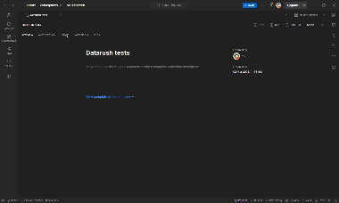
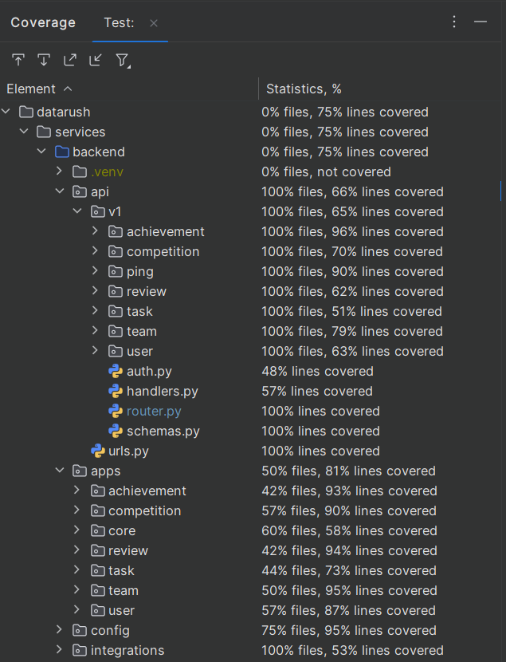

# DataRush

Инновационный сервис для проведения соревнований по анализу данных

## Запуск

Склонируйте репозиторий и пропишите.

```bash
docker compose up
```

## Важные эндпоинты

* `/` - интерфейс
* `/api/v1/docs` - swagger-ui документация
* `/admin/` - админка
* `/admin/grafana` - Grafana
* `/docs` - обучающие материалы по анализу данных

После запуска по методу выше создается пользователь в админке (`/admin/`) с данными ниже:

* `admin` - логин
* `prooooooood` - пароль

Данные для Grafana:

* `admin` - логин
* `proooooood` - пароль

## Как устроен проект

В проекте используются 3 основных модуля: backend, frontend и checker

1. `backend` представляет собой приложение, написанное на Django с применением [Django Ninja](https://django-ninja.dev/), который позволяет быстро и легко создавать Restful API.

    Сам бекенд состоит из 2-х основных компонентов: приложений (где хранятся модели, тесты и настройки админ-панели) и основных колбеков (где хранятся схемы OpenAPI и сами ручки)

    Решения на проверку отсылаются через `celery` для асинхронного взаимодействия.

2. `frontend` является React приложением, которое запускается через Vite. В нем также используется TypeScript для более строгой типизации. Структура приложения является стандартной для подобного вида проектов: есть отдельная папка для компонентов, страниц, стилей, работы с API.

3. `checker` - микросервис на FastAPI, созданный для безопасного асинхронного запуска посылок пользователей.

    Данные в этот сервис отсылаются по специальной ручке `/execute`.

    Проверка заданий осуществляется через запуск кода пользователя через Docker контейнер, на который выдаются следующие ресурсы:

* 50% одного ядра
* 100 МБ ОЗУ

    Решению доступны следующие библиотеки для работы с данными:

    ```python
    pandas==2.2.3
    numpy==2.2.3
    matplotlib==3.10.1
    scipy==1.15.2
    scikit-learn==1.6.1
    seaborn==0.13.2
    statsmodels==0.14.4
    ```

    Контейнеру дается 1 минута на выполнение кода, потом - контейнер удаляется.

## Тесты

Написаны unit-тесты (на базе Django TestCase) и E2E (Postman коллекция). Они покрывают flow регистрации, просмотра и участия в соревновании.

Unit-тесты находятся в соответствующих приложениях, которые располагаются по пути `services/backend/apps`

Postman коллекция, c E2E тестами: [tests/postman_collection.json](./tests/postman_collection.json)

Запуск Postman коллекции:



Покрытие тестами бекенда данного приложения:


