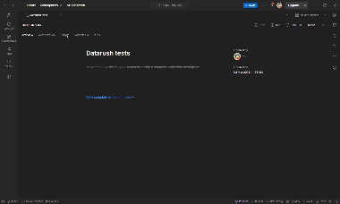

# DataRush

Инновационный сервис для проведения соревнований по анализу данных


## Запуск

Склонируйте репозиторий и пропишите 

```bash
docker compose up
```

## Основные ручки

* `/` - основное приложение
* `/api/v1/docs` - swagger-ui документация
* `/admin` - админка
* `/admin/grafana` - графана
* `/docs` - гайд по анализу данных

После запуска по методу выше создается пользователь в админке (`/admin`) с данными ниже:`admin` 
- `admin` - логин
- `proooooood` - пароль


## Тесты

Написаны unit-тесты (на базе Django TestCase) и E2E (Postman коллекция)




